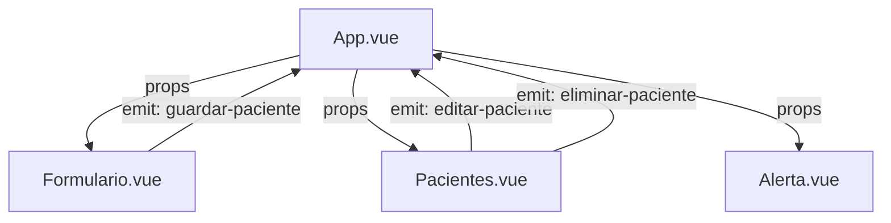

# 🐾 Administrador de Pacientes — Vue 3 + TypeScript + Vite

Aplicación web para el **seguimiento y administración de pacientes veterinarios**, desarrollada con **Vue 3 (Composition API)** y **TypeScript**.  
Permite registrar, editar y eliminar mascotas con sus respectivos datos y mostrar alertas de validación visualmente limpias.

---

## 🚀 Tecnologías

- ⚡ **Vite** — Entorno de desarrollo rápido.
- 🧩 **Vue 3** — Framework progresivo con Composition API.
- 🔷 **TypeScript** — Tipado estático para mayor robustez.
- 💅 **TailwindCSS** — Estilos modernos y responsivos.

---

## 📂 Estructura del Proyecto

```bash
src/
├── assets/                # Imágenes, íconos o estilos globales
│
├── components/
│   ├── Formulario.vue     # Formulario para agregar o editar pacientes
│   ├── Pacientes.vue      # Listado de mascotas registradas
│   └── Alerta.vue         # Componente reutilizable de alertas visuales
│
├── interfaces/
│   └── Mascota.ts         # Definición de tipos e interfaces del proyecto
│
├── App.vue                # Componente raíz, contiene toda la lógica principal
└── main.ts                # Punto de entrada de la aplicación
```

## 🔄 Flujo de la Aplicación

### 1️⃣ Registro de Pacientes
El usuario ingresa los datos de la mascota (nombre, propietario, email, fecha y síntomas) en el componente `Formulario.vue`.

**Validación local:**
- Si algún campo está vacío → se muestra una alerta de error.
- Si todo está correcto → se emite el evento `guardar-paciente`.
- El componente `App.vue` escucha este evento y agrega o actualiza el registro en el array de pacientes.

### 2️⃣ Listado y Edición
El componente `Pacientes.vue` recibe la lista de mascotas desde `App.vue`.

Cada tarjeta de paciente muestra:
- Nombre de la mascota.
- Propietario.
- Email y fecha de alta.
- Síntomas.

Incluye botones de:
- ✏️ **Editar:** emite un evento hacia `App.vue` con el ID del paciente.
- 🗑️ **Eliminar:** solicita confirmación antes de eliminar.

### 3️⃣ Eliminación
Al confirmar la acción de eliminar:
- Se ejecuta una función en `App.vue` que filtra el paciente por id.
- Se muestra una alerta de confirmación o éxito mediante `Alerta.vue`.

### 4️⃣ Alerta de Validación
El componente `Alerta.vue` recibe un objeto alerta con:

```ts
{
  tipo: 'error' | 'exito',
  mensaje: string
}
```

Muestra visualmente el mensaje con estilo condicional según el tipo.

---

## 🧱 Interfaces (TypeScript)

**interfaces/Mascota.ts**

```ts
// Interfaz que define la estructura de un paciente (mascota)
export interface Mascota {
  id?: string | null       // ID único (puede ser null mientras se crea)
  nombre: string           // Nombre de la mascota
  propietario: string      // Nombre del propietario
  email: string            // Correo del propietario
  alta: string             // Fecha de alta (YYYY-MM-DD)
  sintomas: string         // Descripción de los síntomas
}

// Interfaz para las alertas de validación o confirmación
export interface Alertas {
  tipo: string             // Tipo de alerta: 'error' o 'exito'
  mensaje: string          // Texto mostrado en pantalla
}
```

---

## 🧠 Relación entre Componentes



### 🧩 Explicación
- `App.vue` es el componente padre que gestiona el estado global (pacientes, alertas).
- `Formulario.vue` y `Pacientes.vue` emiten eventos hacia `App.vue`.
- `Alerta.vue` se usa para mostrar mensajes globales en toda la aplicación.

---

## ⚙️ Scripts Disponibles

```bash
# Instalar dependencias
npm install

# Ejecutar en desarrollo
npm run dev

# Compilar para producción
npm run build

# Previsualizar compilado
npm run preview
```

---

## 🧩 Buenas Prácticas Aplicadas

✅ Componentes pequeños y reutilizables  
✅ Tipado estático con TypeScript  
✅ Comunicación padre-hijo mediante props y emit  
✅ Validación local antes de emitir eventos  
✅ Estilo uniforme y responsive con TailwindCSS  
✅ Separación clara de lógica, interfaz y datos  

---

## 👨‍💻 Autor

**Aldair Cruz Bautista**  
📧 Desarrollador Frontend Vue 3 + TypeScript  
💼 Proyectos educativos y dashboards interactivos  

---

## 📜 Licencia

Este proyecto está bajo la licencia **MIT**.  
Puedes usarlo, modificarlo y distribuirlo libremente con atribución al autor original (Juan Pablo de la Torre).
